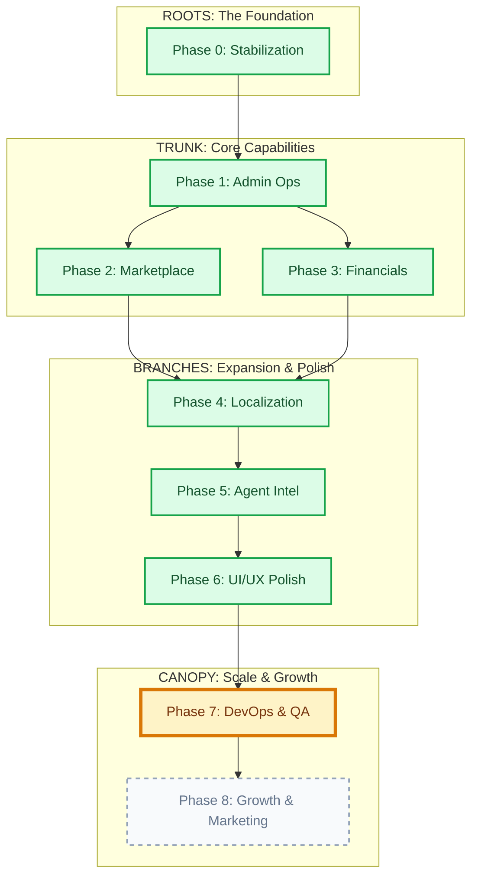

# Kosmoi Project Evolution Map 🌳

This map visualizes the project's growth from its roots to the current state and future branches. It provides the "Big Picture" view of the "Mega Tasks" (Phases).

## The Growth Tree

## Detailed Phase Status

### ✅ ROOTS & TRUNK (Completed)
- **Phase 0 (Stabilization)**: The system is stable, assets are local, database is robust.
- **Phase 1 (Admin)**: Full control over users, agents, and business data.
- **Phase 2 (Marketplace)**: Real booking flow with conflict resolution.
- **Phase 3 (Financials)**: Wallet system with transaction ledger (simulated stripe).
- **Phase 4 (Global)**: Full RTL support and Localization infrastructure.
- **Phase 5 (Agents)**: Smart agents with RAG memory and tool usage.
- **Phase 6 (Polish)**: Premium Glass UI that wows the user.

### 📍 CURRENT LOCATION
- **Phase 7 (DevOps & Hygiene)**: 
  - We are here.
  - **Goal**: Professionalize the codebase for team scale.
  - **Tasks**: Git hygiene, CI/CD pipelines, Unit/E2E Testing, Security Audits.

### 🔭 THE FUTURE (Canopy)
- **Phase 8 (Growth)**:
  - **Goal**: Get users and revenue.
  - **Tasks**: SEO optimization, Email marketing loops, Referral systems, Analytics.

---
*Created automatically to track the evolution of the Kosmoi Project.*
